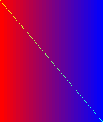

# Symbian HLE

The CPU is the easy part. **Symbian is the project.** An N-Gage game is a Series 60 application running on Symbian OS 6.1; it doesn't touch hardware directly — it talks to OS servers over Symbian's client/server IPC and links against system DLLs by **ordinal**.

To run a recompiled game natively, every import it resolves must be answered by a native implementation. This document tracks that surface.

## How imports work in an `E32Image`

The import table lists, per dependency DLL, the **ordinals** the game needs. There are no names in the executable — ordinal N of `EUSER.DLL` is whatever the matching SDK's `.def` file says it is. So the HLE effort is:

1. Read the import table → list of `(DLL, ordinal)` pairs the game actually uses.
2. Map each ordinal back to its Symbian SDK function signature (via the Series 60 v1 SDK `.def` files).
3. Implement that function natively (or stub it, loudly, until something needs it).

This is tractable precisely because we only have to implement **what a given game imports**, not all of Symbian.

## The likely bring-up set for SonicN

A 2D action-platformer port realistically needs a small core:

| Subsystem | Symbian DLL(s) | What the game wants |
|---|---|---|
| Process / heap / descriptors | `EUSER` | `RHeap` alloc, `TDes`/`TBuf` string ops, cleanup stack, active scheduler |
| File I/O | `EFSRV` | open & read the `*.bin` asset files (`action_char*.bin`, `etcdata.bin`, `snd*.bin`) |
| Bitmaps | `FBSCLI` (font/bitmap server) | decode `images.mbm` / `volume.mbm` (Symbian Multi-BitMap) |
| Screen | window server (`WS32`) / direct screen access | get a framebuffer and present it |
| Input | window server | N-Gage D-pad + keys (`5`=action, soft keys) |
| Sound | N-Gage / Series 60 audio | play `snd*.bin` streams |

The honest expectation: input + file I/O + framebuffer present is enough to get a **first frame and a controllable Sonic**; sound and the long tail of `EUSER` come after.

## Strategy

- **Import-driven, demand-paged.** Implement an ordinal the first time the game faults on its stub. Every stub logs `UNIMPLEMENTED EUSER ordinal 123` so progress is measured by what's left, not guessed.
- **Lean on EKA2L1.** Its HLE has already mapped huge chunks of this surface; we mirror semantics rather than rediscover them.
- **MBM and asset formats are documented** (Symbian Multi-BitMap), so the asset decoders are normal data-format work, not reverse engineering.

## How a call reaches the HLE (realized)

Each imported function is a slot in the image's **import address table** (IAT) — for
SonicN, 233 slots in the data section (e.g. `memcpy` at `0x1014f688`). The game calls
indirectly:

```asm
ldr  r12, =slot        ; address of the IAT slot
ldr  r12, [r12]        ; the resolved function pointer (loader-patched)
blx  r12               ; call it
```

`ngage_hle_init()` (generated by `recompiler/gen_hle.py` from `imports.json`) makes each
slot **point to itself** and registers that address with the dispatch table:

```c
ngage_w32(c, 0x1014f688u, 0x1014f688u);          /* slot -> self */
ngage_register(0x1014f688u, hle_memcpy);          /* dispatch -> shim */
```

So `ldr r12,[slot]` yields the slot address and `blx r12` → `ngage_call(c, slot)` →
the native shim. Unimplemented imports get a generated stub that logs the **exact
Symbian name** (`EFSRV:RFile::Open`), so what's missing is always named, never guessed.

**Shim ABI:** ARM EABI — integer args in r0–r3, `this` in r0 for C++ methods, return in
r0 (r0:r1 for 64-bit). Shims read/write `ngage_cpu_t`.

**Memory:** flat, base-biased (`c->mem = buffer - NGAGE_IMAGE_BASE`) so a guest address
indexes the backing buffer directly. A paged model can replace this without touching
generated code or shims.

## Status

**89 / 233 implemented**, 144 named-stubbed (`runtime/src/hle/*` + `runtime/src/`). Added the
**audio output stream** (`hle/media.c`): a `CMdaAudioOutputStream` HLE object with a
synthetic no-op vtable (reusable pattern for any HLE-created C++ object the game calls
virtually). Three lifter bugs fixed along the way (see the recompiler README).

**The recompiled game boots, runs its game loop, and executes its render code.** `ConstructL`
completes (`rc=0`), the `CPeriodic` tick runs cleanly for hundreds of frames, and the game
**renders into a CFbsBitmap backbuffer** (118 `DataAddress` calls over 300 ticks) which the
present pipeline captures as a real 256×256 frame.

Getting here needed: `CFbsBitmap::Load` (FBSCLI ord 156) + `CFbsBitmapDevice::NewL` (BITGDI
ord 170) + synthetic no-op vtables on the graphics objects (device/gc/bitmap) so their
virtual calls and deletes resolve; jump-table lowering in the lifter (the tick is full of
switches); and the audio/active-object HLE before it.

**The game advances through its states and loads its real assets.** `User::TickCount` was a
constant stub, freezing the game's frame timing on the first screen; implementing it (+
`User::After`) to advance one tick per frame unfroze it. The game now progresses through
init and **loads its actual graphics assets** — `action_char4.bin` (3.6 MB of character
graphics), `action_char8.bin`, `etcdata.bin` (levels), sound — through EFSRV, then runs its
sprite/tile-setup code (`sub_1000B188`/`sub_100EBCC4`).

**Honest state:** the next fault is a null-deref in that sprite-setup path — the ongoing
HLE grind, now deep in the real gameplay data path. The earlier captured frame is still a
blank clear; recognizable graphics need the sprite-decode path to run, which is the current
frontier. The pixel pipeline, asset I/O, timing, and game-loop are all proven with real
game code.

Added for the bootstrap: **descriptors** (`hle/descriptors.c`), the **CPeriodic** game-loop
timer + a pump (`hle/scheduler.c`), `CEikAppUi::ApplicationRect` (`hle/coe.c`), and the
**compiler runtime** (`hle/softfloat.c`: 22 libgcc soft-float/integer-divide helpers — the
game does double math during init). `User::Panic` is now correctly **fatal** (a returning
panic caused runaway retry recursion). See the per-game
[boot-chain trace](https://github.com/sp00nznet/sonicn-ngage/blob/main/docs/BOOT-CHAIN.md).

Driving `AppUi::ConstructL` runs deep — allocation, descriptors, sub-object construction,
float math — then panics at the **active-object state check** and unwinds cleanly via
`ngage_run`. The frontier is the **active-object / async machinery** (the stubbed scheduler
never advances `CActive` state): real `CActive` request/complete + `RTimer` firing + the
run loop, plus the nested-`TRAP` lifter hook (the game's retry loop uses `TRAP`).

### Debugging the bring-up

Two facilities locate each fault (in `runtime/src/`):
- **Memory guard** (`-DNGAGE_MEM_GUARD`, `debug.c`): a wild guest access reports its
  address + the recent call trace instead of a blind host segfault.
- **Recursion + call-trace guard** (`dispatch.c`): the dispatcher keeps a 32-entry ring of
  dispatched addresses and aborts with it on runaway recursion (native stack mirrors guest
  depth). This is how the LDM bug and the panic loop were both pinpointed.


- **mem:** `memcpy`, `memset`, `Mem::FillZ`
- **heap / new / delete:** `CBase::operator new` (zeroed), `CBase::operator new + TLeave`,
  `User::AllocL`, `operator new[]`, `operator delete` / `delete[]` — over a real guest
  allocator (`heap.c`: first-fit + bump, free-list reuse, returns guest addresses)
- **leave / cleanup / lifecycle:** `User::LeaveIfError`, `TTrap::Trap` / `UnTrap`,
  `CleanupStack::PushL` / `Pop` / `PopAndDestroy(/N)`, `User::Exit`, `User::Panic`,
  `RHandleBase::Close` — over the leave machinery (`kernel.c`: setjmp/longjmp trap +
  cleanup stack)
- **EFSRV (file server):** `RFs::Connect`, `RFile::Open`/`Create`/`Read`(×2)/`Write`/
  `Size`/`Seek`/`SetSize`/`Flush`, `RFs::Delete`/`MkDir`, `RFsBase::Close` — host-file
  backing under a mounted root (`hle/efsrv.c`), with full Symbian **descriptor** decode
  (`desc.c`: TBufC/TPtrC/TPtr/TBuf/TBufCPtr → flat ptr/len/maxlen).
- **graphics (FBSCLI/BITGDI/NOKIAFC):** `CFbsBitmap` ctor/`Create`/`DataAddress`/
  `SizeInPixels`/`DisplayMode`/`Header`, `RFbsSession::Connect`, `CFbsDevice::CreateContext`
  + the BitGc setters, and `NOKIAFC` flip (`hle/fbserv.c`). `CFbsBitmap::Create` allocates
  a real guest pixel buffer; the game software-renders into `DataAddress()`; the flip runs
  the framebuffer presenter (`framebuffer.c`: EColor4K/EColor64K/EGray256/EColor16MU →
  RGB888, DWORD-aligned scanlines). The pipeline is verified end-to-end — a bitmap rendered
  in the guest and flipped produces a correct image:

  

  *(176×208 frame: guest writes RGB565 into the CFbsBitmap buffer, present converts + emits
  it. This is the path SonicN's own render code will drive once the app framework boots.)*

Beyond the HLE imports, two generators wire the recompiled program together:
`gen_register.py` registers all 2,621 lifted functions at their guest addresses (so the
game calls itself through dispatch), and dispatch is a lazily-sorted binary search.

Verified: heap alloc/free/reuse; a `LeaveIfError(-4)` deep in a call unwinds through
`ngage_run`, runs the cleanup stack, returns the code; the game **calls its own
functions** by address; it **reads a real asset file** (`volume.mbm`: correct size +
byte-exact content) through `RFile::Open`/`Size`/`Read`; and the **bitmap→present pixel
pipeline** produces a correct frame (above). The whole lifted game + runtime + HLE link
into **one executable** that runs its init path.

## Bootstrap — first contact

The recompiled game's **own code now runs**. Two pieces made it possible:

- **Image loader** (`image.c` + `gen_image.py`): the lifted *code* is native, but it reads
  the image's *data* — vtables, jump tables, const pools — from guest addresses. Those
  segments are now loaded into the flat window at startup (`segments.bin`).
- **Virtual dispatch** (`ngage_vcall`): reads an object's vtable pointer and calls the slot,
  so the framework↔game virtual-method dance works.

With those, calling the app's single export **`NewApplication()` executes end-to-end**:
it `operator new`s the app object, runs the (stubbed) `CEikApplication` ctor, installs the
vtable, returns a valid object. Driving the next step — **`CreateDocumentL` dispatches
correctly through the vtable** (`+0x10`).

## What's still between here and the game drawing itself

SonicN's draw code runs only after the **S60 app framework boots**: walk the
`CEikApplication → document → CAknAppUi → CCoeControl` override chain (each a vtable
dispatch into game code), stand up the **active scheduler** + the game's **`CPeriodic`**
tick (its render loop — no `CActiveScheduler::Start` is imported, so the loop is a periodic
timer), and reach `CCoeControl::Draw`. That chain (CONE/EIKCORE/AVKON, ~120 imports) is the
remaining block. The nested-`TRAP` lifter hook lands here too, since the framework leans on
leaves. The framebuffer pipeline it will feed already works (above).

| Status | Meaning |
|---|---|
| ⬜ not started | |
| 🟨 stubbed | named stub: logs the Symbian function when hit |
| 🟩 implemented | real behavior, exercised |

Next: the EUSER heap (`User::Alloc`/`AllocL`, `RHeap`, `operator new`) and the
`TRAP`/cleanup-stack machinery (Symbian's leave model, via setjmp/longjmp), then EFSRV
file reads to load SonicN's `*.bin` assets, then the framebuffer path.
